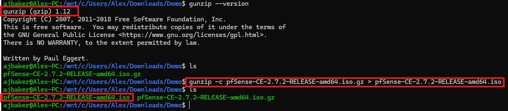
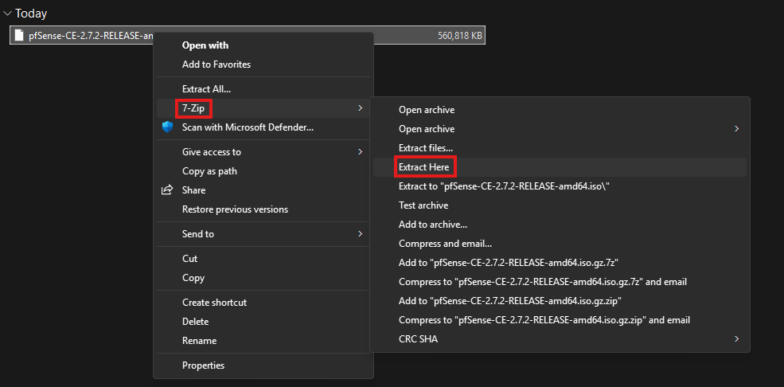
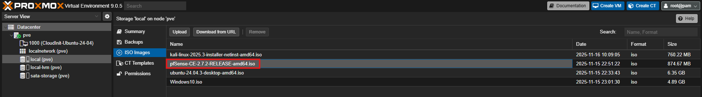

# pfSense Virtual Machine

The pfSense virtual machine will be the heart of our experimental network. It will route all of the traffic for the rest of the VMs and provide realistic network segments for our DLP project.

## Obtain the pfSense ISO installer

- A copy of the pfSense ISO can be obtained from this [mirror](https://atxfiles.netgate.com/mirror/downloads/) server provided by Netgate. For this lab, pfSense is serving as more of a platform for our other devices so the specific version does not matter. Just download the latest available image.

- Netgate provides the pfSense images in a image.iso.gz format that will need to be decompressed prior to loading it into your hypervisor.

	- To decompress the file on linux, simply run 'gunzip -c pfsense.iso.gz > pfsesne.iso' 
	
	- To decompress the file on Windows, you can use 7zip. Simply right click on the file, select 7-Zip, and click Extract Here.  
- Finally, upload the ISO file to Proxmox (or your virtualization platform of choice)
## Creating the VM

Virtualizing a router takes a few extra steps than most VMs, but its pretty straightforward if its just for a lab environment. Basically you will need to have at least two assignable interfaces so you can distinguish WAN and LAN traffic. For this lab, we also want the LAN side to be VLAN aware.

### Creating Interfaces for pfSense in Proxmox

Proxmox by default is managed over its own web interface and has a default bridge interface we can use to allow our pfSense VM to access the internet, but we also need to make an internal interface that will serve as the backplane of our lab network.

To manage Proxmox's network interfaces, sign in to the web UI and navigate to `Datacenter > 'servername' > System > Netowrk` and you will see a list of interfaces for your Proxmox server.

Next, we want to identify our bridge interface. This will be what we assign to our pfSense VM to act as the WAN side of the router. For my setup it is `vmbr0`, and since my home network has configured VLANS, I also need to ensure that the bridge is VLAN aware, so I can put the VM on my lab network so it doesn't interfere with regular operations.
